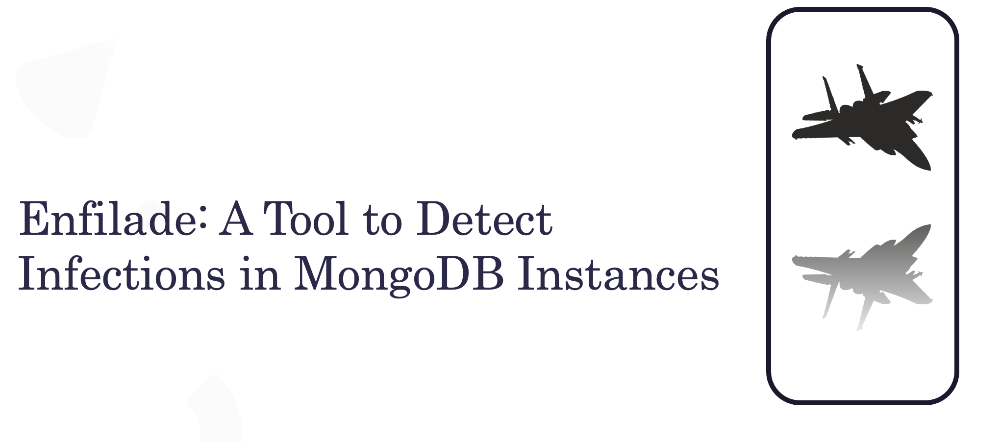

# Enfilade: Tool to Detect Infections in MongoDB

Attackers are targeting MongoDB instances for conducting nefarious operations on the Internet. The cybercriminals are targeting exposed MongoDB instances and trigger infections at scale to exfiltrate data, destruct data,and extort money via ransom. For example one of the significant threats MongoDB deployments is facing is ransomware. During this talk, we will release atool named "ENFILADE" to detect potential infections in the MongoDB instances. The tool allows security researchers, penetration testers, and threat intelligence experts to detect compromised and infected MongoDB instances running malicious code. The tool also enables you to conduct efficient research in the field of malware targeting cloud databases. In this release of the tool, the following modules are supported: 

* MongoDB instance information gathering and reconnaissance 
* MongoDB instance exposure on the Internet 
* MongoDB access permissions for assessing remote command execution
* MongoDB user enumeration
* MongoDB ransomware infections 
     - Basic assessment checks for detecting ransomware infections 
     - Intrusive assessment checks for extracting insidious details about potential ransomware infections
* MongoDB meow bot infections
     - Basic assessment checks for detecting ransomware infections 
     - Intrusive assessment checks for extracting insidious details about potential ransomware infections

--------------

This is the first release of the tool and we expect to add more modules in the nearby future. This work is done in collaboration with the Research Team at the Office of the CTO, F5 (https://www.f5.com/company/octo)

--------------

Researched and Developed By Aditya K Sood and Rohit Bansal 

--------------

Note: The tool was selected to be released at BlackHat Arsenal USA 2021. Due to COVID-19 Delta variant and travel challenges, we were not able to present in-person at the conference. We are releasing the project directly at GitHub.

--------------
